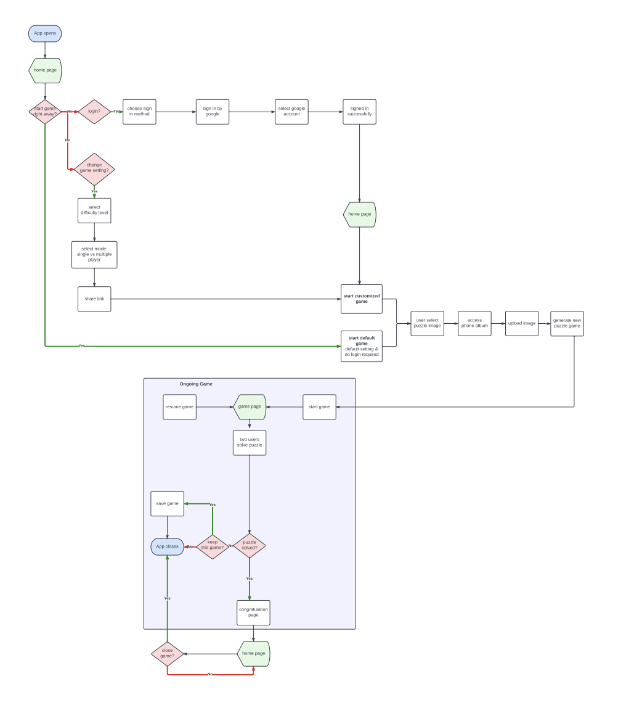
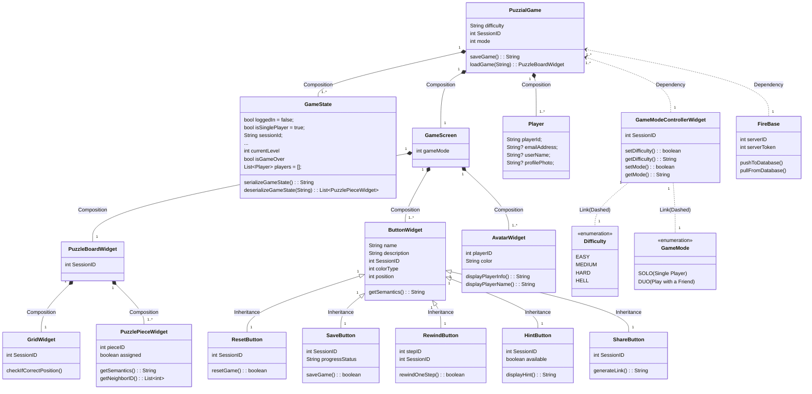
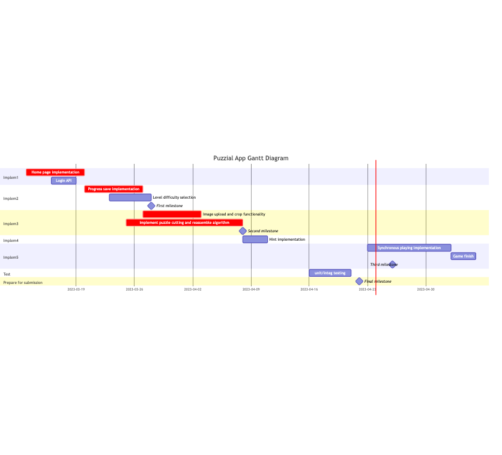

# Puzzial SRS

\*- Team Young Justice

 
 

## Table of Content

- [Puzzial SRS Round 3](#puzzial-srs-round-3)
  - [Table of Content](#table-of-content)
  - [1. Purpose](#1-purpose)
    - [      1.1 Definitions](#11-definitions)
    - [      1.2 Background](#12-background)
  - [2. Overall Description](#2-overall-description)
    - [      2.1 User Characteristics](#21-user-characteristics)
    - [      2.2 User Stories](#22-user-stories)
    - [      2.3 App Workflow](#23-app-workflow)
  - [3. Requirements](#3-requirements)
    - [      3.1 Functional Requirements](#31-functional-requirements)
    - [      3.2 Non-functional Requirements](#32-non-functional-requirements)
  - [4. Wireframes](#4-wireframes)
  - [5. UML Class Diagram](#5-uml-class-diagram)
  - [6. Gantt diagram](#6-gantt-diagram)
  - [7. Traceability Matrix](#7-traceability-matrix)

 
 

## 1. Purpose

 

### &nbsp;&nbsp;&nbsp;&nbsp;&nbsp;&nbsp;<ins>1.1 Definitions</ins>

&nbsp;&nbsp;&nbsp;&nbsp;&nbsp;&nbsp;&nbsp;&nbsp;_The mobile puzzle app is an online platform that enables users to solve puzzles collaboratively. The app uses user-uploaded images to generate unique puzzles, employing a randomized puzzle cut algorithm for a new experience each play. _

 

### &nbsp;&nbsp;&nbsp;&nbsp;&nbsp;&nbsp;<ins>1.2 Background</ins>

&nbsp;&nbsp;&nbsp;&nbsp;&nbsp;&nbsp;&nbsp;&nbsp;_The target audience for the app is individuals who enjoy puzzle games but do not have the time or space to engage in traditional puzzle-solving methods. The app offers a convenient alternative, filling a niche gap in the market by enabling concurrent solving. The app provides a fun and engaging experience for users to solve puzzles together and fostering collaboration among puzzle enthusiasts. With its unique features and functionalities, the app offers a fresh and innovative approach to puzzle solving._

 
 

## 2. Overall Description

 

### &nbsp;&nbsp;&nbsp;&nbsp;&nbsp;&nbsp;<ins>2.1 User Characteristics</ins>

- _Puzzle enthusiasts who enjoy solving simple puzzles._
- _Individuals who lack time or space to engage in traditional puzzle-solving methods._
- _Users who enjoy collaborative puzzle solving._
- _Individuals who prefer online puzzle games over traditional physical ones._
- _Users who are seeking a convenient and accessible puzzle-solving platform._
- _Users who are looking for a fun and engaging puzzle-solving experience._
- _People who prefer to save their progress and pick up where they left off._
- _Users who are interested in trying out a new and innovative approach to puzzle solving._

 

### &nbsp;&nbsp;&nbsp;&nbsp;&nbsp;&nbsp;<ins>2.2 User Stories

- _As a puzzle enthusiast, I want to be able to solve puzzles with other users in a collaborative setting, so that I can share my love for puzzles with others._
- _As someone who lacks time for traditional puzzle-solving methods, I want to be able to play puzzle games on my mobile device, so that I can engage in puzzle solving whenever I have free time._
- _As someone who enjoys trying new approaches to puzzle solving, I want to be able to use user-uploaded images to generate unique puzzles, so that I can have a new experience each time I play._
- _As someone who enjoys saving my progress, I want to be able to pick up where I left off when I return to the app, so that I can easily resume my puzzle-solving journey._
- _As a user who is looking for a fun and engaging experience, I want to be able to play puzzles with friends and family, so that I can share a common interest and have fun together._
- _As someone who values accessibility and convenience, I want to be able to play puzzle games online, so that I can engage in puzzle solving without having to worry about carrying physical puzzle pieces._

 

### &nbsp;&nbsp;&nbsp;&nbsp;&nbsp;&nbsp;<ins>2.3 App Workflow

&nbsp;&nbsp;&nbsp;&nbsp;&nbsp;&nbsp;

 
 

## 3. Requirements

 

-> **Bold: Critical requirements**
 
-> _Italicized: Nice-to-have requirements_
 
 

### &nbsp;&nbsp;&nbsp;&nbsp;&nbsp;&nbsp;<ins>3.1 Functional Requirements

1. **Randomized puzzle cut algorithm.**
2. **Puzzle difficulty level setting.**
3. **User-uploaded image support.**
4. **Simultaneous game state display to two users.**
5. **User progress saving in current game.**
6. **Collaborative puzzle solving.**
7. **User-friendly interface.**
8. _Pre-set image store._
9. _Time-based competition._
10. _Social networking integration._
11. _Puzzle solving modes - competitive._
12. _Puzzle solver ranking system._
13. _Puzzle creation and solving tutorial._
14. _In-app purchases for additional content._

 

### &nbsp;&nbsp;&nbsp;&nbsp;&nbsp;&nbsp;<ins>3.2 Non-functional Requirements

1. **Easy installation and setup.**
2. **User account management.**
3. **Responsiveness to user interactions.**
4. _User data privacy and security._
5. _Compatibility with multiple mobile devices._
6. _User experience design._
7. _Scalability for future growth._
8. _High availability and reliability._
9. _Continuous integration and deployment._
10. _Easy maintenance and updates._
11. _Support for multiple languages._
12. _User feedback and bug reporting system._
13. _Accessibility for visually impaired users._

 
 

## 4. Wireframes

[**-> Link to Puzzial Wireframes**](./puzzial-hifi-updated.pdf)

 
 

## 5. UML Class Diagram

 
 

## 6. Gantt diagram

 
 

## 7. Traceability Matrix

_Please refer [3. Requirements](#3-requirements) for Details of Each Requirement ID_

|                   | Requirement ID | 3.1.1 | 3.1.2 | 3.1.3 | 3.1.4 | 3.1.5 | 3.1.6 | 3.1.7 | 3.2.1 | 3.2.2 | 3.2.3 | 3.2.4 | 3.2.5 | 3.2.6 | 3.2.10 | 3.2.13 |
| ----------------- | -------------- | ----- | ----- | ----- | ----- | ----- | ----- | ----- | ----- | ----- | ----- | ----- | ----- | ----- | ------ | ------ |
| Test Case ID      |                |       |       |       |       |       |       |       |       |       |       |       |       |       |        |        |
| 0.0               |                | X     |       |       | X     |       |       |       |       |       |       |       |       |       |        |        |
| 0.1               |                | X     |       | X     | X     |       |       |       |       |       | X     |       |       |       |        |        |
| MVP V1 (1.0)      |                | X     |       | X     | X     | X     |       |       |       |       | X     |       | X     |       |        |        |
| 1.1               |                | X     |       | X     | X     | X     | X     |       |       |       | X     |       | X     | X     |        |        |
| 1.2               |                | X     |       | X     | X     | X     | X     | X     |       |       | X     | X     | X     | X     |        |        |
| MVP V2 (2.0)      |                | X     |       | X     | X     | X     | X     | X     |       | X     | X     | X     | X     | X     |        |        |
| 2.1               |                | X     |       | X     | X     | X     | X     | X     |       | X     | X     | X     | X     | X     |        |        |
| 2.2               |                | X     |       | X     | X     | X     | X     | X     |       | X     | X     | X     | X     | X     |        |        |
| MMR (3.0)         | X              | X     | X     | X     | X     | X     | X     | X     |       | X     | X     | X     | X     | X     |        |        |
| 3.1               | X              | X     | X     | X     | X     | X     | X     | X     |       | X     | X     | X     | X     | X     |        |        |
| 3.2               | X              | X     | X     | X     | X     | X     | X     | X     | X     | X     | X     | X     | X     | X     |        | X      |
| 3.3               | X              | X     | X     | X     | X     | X     | X     | X     | X     | X     | X     | X     | X     | X     |        | X      |
| 3.4               | X              | X     | X     | X     | X     | X     | X     | X     | X     | X     | X     | X     | X     | X     | X      | X      |
| 3.5               | X              | X     | X     | X     | X     | X     | X     | X     | X     | X     | X     | X     | X     | X     | X      | X      |
| Pre-Release (4.0) | X              | X     | X     | X     | X     | X     | X     | X     | X     | X     | X     | X     | X     | X     | X      | X      |
| 4.1               | X              | X     | X     | X     | X     | X     | X     | X     | X     | X     | X     | X     | X     | X     | X      | X      |
| 4.2               | X              | X     | X     | X     | X     | X     | X     | X     | X     | X     | X     | X     | X     | X     | X      | X      |
| Launch (5.0)      | X              | X     | X     | X     | X     | X     | X     | X     | X     | X     | X     | X     | X     | X     | X      | X      |
