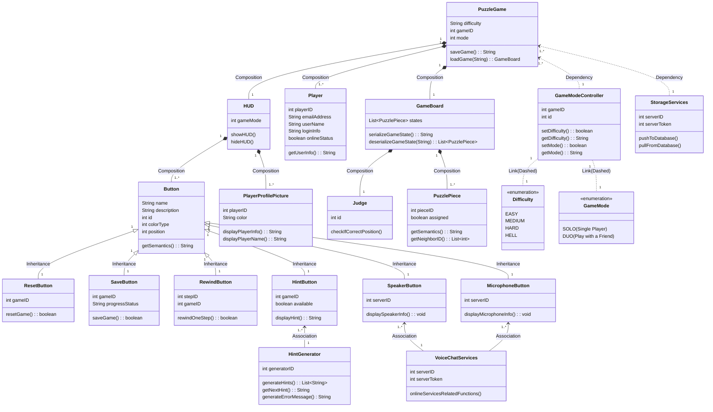

```mermaid
classDiagram

class Difficulty{
    <<enumeration>>
    EASY
    MEDIUM
    HARD
    HELL
}

class Button{
    String name
    String description
    int id
    int colorType
    int position

    getSemantics(): String
}

class ResetButton{
    int gameID

    resetGame(): boolean
}

class SaveButton{
    int gameID
    String progressStatus

    saveGame(): boolean
}

class RewindButton{
    int stepID
    int gameID

    rewindOneStep(): boolean
}

class HintButton{
    int gameID
    boolean available

    displayHint(): String
}

class SpeakerButton{
    int serverID
    
    displaySpeakerInfo(): void
}

class MicrophoneButton{
    int serverID
    
    displayMicrophoneInfo(): void
}

class GameMode{
    <<enumeration>>
    SOLO (Single Player)
    DUO (Play with a Friend)
}


class PuzzlePiece{
    int pieceID
    boolean assigned

    getSemantics(): String
    getNeighborID(): List~int~
}

class Player{
    int playerID
    String emailAddress
    String userName
    String loginInfo
    boolean onlineStatus

    getUserInfo(): String
}

class PuzzleGame{
    String difficulty
    int gameID
    int mode

    saveGame(): String
    loadGame(String): GameBoard
}

class HUD{
    int gameMode
    
    showHUD()
    hideHUD()
}

class GameBoard{
    List~PuzzlePiece~ states

    serializeGameState(): String
    deserializeGameState(String): List~PuzzlePiece~
}

class PlayerProfilePicture{
    int playerID
    String color

    displayPlayerInfo(): String
    displayPlayerName(): String
}   

class GameModeController{
    int gameID
    int id

    setDifficulty(): boolean
    getDifficulty(): String
    setMode(): boolean
    getMode(): String
}

class VoiceChatServices{
    int serverID
    int serverToken

    onlineServicesRelatedFunctions()
}

class HintGenerator{
    int generatorID

    generateHints(): List~String~
    getNextHint(): String
    generateErrorMessage() String
}

class StorageServices{
    int serverID
    int serverToken

    pushToDatabase()
    pullFromDatabase()
}

class Judge{
    int id

    checkIfCorrectPosition()
}

PuzzleGame "1" *-- "1" HUD : Composition
PuzzleGame "1" *-- "1..*" Player : Composition
PuzzleGame "1" *-- "1" GameBoard : Composition
GameBoard "1" *-- "1" Judge : Composition
GameBoard "1" *-- "1..*" PuzzlePiece : Composition
HUD "1" *-- "1..*" Button : Composition
HUD "1" *-- "1..*" PlayerProfilePicture : Composition


PuzzleGame "1..*" <.. "1" GameModeController : Dependency
PuzzleGame "1..*" <.. "1" StorageServices : Dependency


GameModeController "1" .. "1" Difficulty : Link(Dashed)
GameModeController "1" .. "1" GameMode : Link(Dashed)

Button "1" <|-- "1" ResetButton : Inheritance
Button "1" <|-- "1" SaveButton : Inheritance
Button "1" <|-- "1" RewindButton : Inheritance


Button "1" <|-- "1" HintButton : Inheritance
Button "1" <|-- "1" SpeakerButton : Inheritance
Button "1" <|-- "1" MicrophoneButton : Inheritance

MicrophoneButton "1..*" <-- "1" VoiceChatServices : Association
SpeakerButton "1..*" <-- "1" VoiceChatServices : Association
HintButton "1..*" <-- "1" HintGenerator : Association

```
